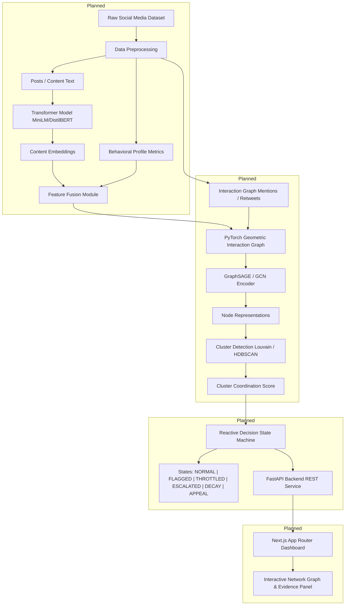

# SyncNet: Coordinated Bot-Network Detection with Reactive Throttling

SyncNet is a research and decision-support prototype designed to detect coordinated inauthentic behavior at the network/cluster level rather than relying solely on individual account classification.

---

## 1. Problem Statement
Traditional bot detection models evaluate accounts individually using static profile attributes or single-tweet text classifiers. Modern coordinated bot networks (astroturfing, disinformation campaigns, orchestrated amplification) intentionally mask individual account anomalies by mimicking human behavior. However, their **coordination patterns**—such as synchronized posting timelines, identical content embeddings, shared interaction subgraphs, and hyper-dense retweets/mentions—reveal network-level inauthenticity.

## 2. Research Gap & Proposed Solution
Single-node account classifiers suffer from high false-positive rates when evaluating authentic users who post frequently, and fail against evasive bots that exhibit realistic profile metadata. 

**SyncNet** bridges this gap by combining:
1. **Behavioral Feature Mining**: Account metadata, timing metrics, and activity ratios.
2. **Transformer Content Embeddings**: MiniLM/DistilBERT representations capturing semantic similarity across posts.
3. **Feature Fusion**: Concatenation of behavioral vectors and semantic embeddings into unified node features.
4. **Graph Neural Networks (GraphSAGE / GCN)**: Learning structural interaction topology from user-user mention/retweet graphs.
5. **Cluster-Level Coordination Scoring**: Detecting synchronized sub-networks using graph clustering and density metrics.
6. **Reactive Simulation Engine**: Decision-support state machine evaluating simulated throttling, escalation, decay, and appeal mechanisms.

> [!IMPORTANT]
> **Simulation Safety Notice**: All reactive actions (throttling, escalation, account flagging) in SyncNet are **strictly simulated** within decision-support UI components and decision state machine logic. SyncNet does not execute enforcement actions against real social media platforms or real users.

---

## 3. End-to-End System Architecture



---

## 4. Hardware Budget & Resource Constraints
- **GPU**: NVIDIA GeForce RTX 5050 (8 GB VRAM). Target VRAM budget: **< 6 GB VRAM** (using MiniLM/DistilBERT, graph sampling, and mixed precision).
- **System RAM**: 24 GB total System RAM. Target project RAM budget: **~16 GB RAM max** (leaving 8 GB for operating system, browser, and development tools).

---

## 5. Repository Structure
```text
SyncNet/
├── README.md                 # Master project documentation
├── PROJECT_STATUS.md         # Chronological project record & status
├── PROJECT_PROGRESS.md       # Task progress matrix & priority tracking
├── LICENSE                   # MIT License
├── .gitignore                # Git exclusion rules
├── .env.example              # Environment variables template
├── docs/                     # System & architecture documentation
│   ├── system_architecture.md
│   └── environment_setup.log
├── data/                     # Dataset storage (README guided)
│   ├── raw/
│   ├── processed/
│   └── features/
├── notebooks/                # ML experimentation notebooks (README guided)
├── backend/                  # FastAPI backend service
│   ├── README.md
│   ├── requirements.txt
│   └── app/
│       ├── main.py
│       └── config.py
├── frontend/                 # Next.js interactive dashboard (README guided)
│   └── README.md
└── scripts/                  # Diagnostic and setup scripts
    ├── verify_gpu.py
    └── verify_pyg.py
```

---

## 6. Installation & Quickstart (Phase 1 Environment)

### Prerequisites
- Python 3.10+
- NVIDIA GPU (RTX 5050 or compatible) with CUDA 12.x drivers
- Git

### Environment Setup
1. Clone the repository:
   ```bash
   git clone https://github.com/01mayankk/SyncNet.git
   cd SyncNet
   ```
2. Activate local Python `.venv` environment:
   - Windows PowerShell:
     ```powershell
     .\.venv\Scripts\activate
     ```
   - Linux/macOS:
     ```bash
     source .venv/bin/activate
     ```
3. Run GPU & PyTorch Geometric verification scripts:
   ```bash
   python scripts/verify_gpu.py
   python scripts/verify_pyg.py
   ```
4. Start minimal FastAPI backend server:
   ```bash
   uvicorn backend.app.main:app --reload --port 8000
   ```
   Visit `http://127.0.0.1:8000/health` to verify API health.

---

## 7. Machine Learning Pipeline Roadmap
1. **Behavioral Baseline**: Logistic Regression & Random Forest baseline on account profile metadata.
2. **Content Baseline**: Transformer embeddings (MiniLM / DistilBERT) classification.
3. **Graph Neural Networks**: PyTorch Geometric implementation of `GCNConv` and `SAGEConv`.
4. **Feature Fusion**: Joint embedding of text representations, behavioral vectors, and GNN node states.
5. **Cluster Coordination & Scoring**: Sub-network cluster extraction and density scoring.

---

## 8. Responsible Design & Limitations
- **Uncertainty & Evidence**: SyncNet output scores indicate behavioral coordination patterns, not absolute proof of malicious intent.
- **Human-in-the-Loop**: Decision support UI presents raw interaction subgraphs, posting timing evidence, and confidence metrics for reviewer evaluation.
- **Simulation**: Enforcement actions are purely simulated for research and decision-support modeling.

---

## 9. License
Distributed under the [MIT License](LICENSE).
