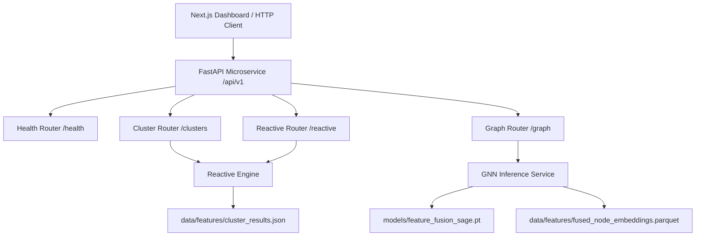

# SyncNet FastAPI Backend Microservice Architecture

## Overview

The SyncNet FastAPI backend microservice serves RESTful APIs for coordinated bot-network detection, interaction graph visualization, cluster analysis, and reactive throttling decision simulation.

## Core Components

### 1. REST API Routers (`backend/app/api/v1/`)
- **Health & Status (`health.py`)**:
  - `GET /health`: GPU VRAM, system RAM budget, environment check.
  - `GET /api/v1/status`: Microservice status, model pre-warming status, PyTorch device details.
- **Cluster Analysis (`clusters.py`)**:
  - `GET /api/v1/clusters`: Returns cluster summary metrics, bot ratio, edge density, semantic text similarity, and cluster coordination score $S_{coord}(C_k)$.
  - `GET /api/v1/clusters/{cluster_id}`: Returns detailed member listing and probabilities for a given cluster.
- **Graph & Node Topologies (`graph.py`)**:
  - `GET /api/v1/graph`: Returns graph node list, predicted labels, cluster assignments, 4-dim embedding previews, and interaction edge links.
  - `GET /api/v1/graph/nodes/{account_id}`: Returns exact account metrics, degree, and 64-dimensional structural GNN embedding vector $Z_{node}$.
- **Reactive Throttle Simulation (`reactive.py`)**:
  - `POST /api/v1/reactive/simulate/throttle`: Triggers simulated rate throttling (e.g. 80%) on cluster or account.
  - `POST /api/v1/reactive/simulate/decay`: Simulates exponential decay of risk scores over elapsed time:
    $$S(t) = \max\left(S_{min}, \, S(0) \cdot e^{-\lambda t}\right)$$
  - `POST /api/v1/reactive/simulate/appeal`: Triggers appeal state transition (`APPEALED`) lifting active throttling.
  - `GET /api/v1/reactive/states/{entity_id}`: Returns current state machine status and active action history.

### 2. GNN & ML Inference Engine (`backend/app/inference/gnn_inference.py`)
- Pre-warms model checkpoint `models/feature_fusion_sage.pt` (GraphSAGE with 396-dim multimodal inputs).
- Serves real-time predictions and 64-dim structural node embedding lookups.

### 3. Reactive Decision Engine (`backend/app/reactive/reactive_engine.py`)
- Manages 6 simulation state transitions: `NORMAL`, `FLAGGED`, `THROTTLED`, `ESCALATED`, `DECAYING`, `APPEALED`.
- Maintains simulation logs and score updates.

---

## Data Flow Diagram



---

## Verification & Testing

Unit test suite located at `backend/tests/test_api_endpoints.py`:
- Endpoint availability, status codes (200 OK), schema validations.
- Run via:
  ```bash
  .venv\Scripts\python.exe -m pytest backend/tests/test_api_endpoints.py
  ```
