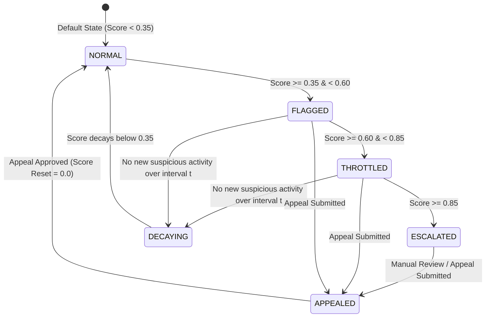

# Reactive Decision Simulation System — SyncNet

**Status**: Baseline Implementation  
**Project**: SyncNet: Coordinated Bot-Network Detection with Reactive Throttling  

---

## 1. Simulation Architecture & Safety Disclaimer

SyncNet strictly separates neural detection (GNN node representation + cluster coordination scoring) from response logic (Reactive Decision State Machine).

> [!IMPORTANT]
> **Simulation Safety Notice**: All reactive actions (throttling, escalation, account flagging, score decay, appeal handling) in SyncNet are **strictly simulated** within decision-support UI components and decision state machine logic. SyncNet does not execute enforcement actions against real social media platforms or real users.

---

## 2. State Threshold Definitions

| State | Score Range ($S$) | Description & Simulated Action |
| :--- | :--- | :--- |
| **`NORMAL`** | $S < 0.35$ | Standard activity. No simulated restriction. |
| **`FLAGGED`** | $0.35 \le S < 0.60$ | Suspicious coordination patterns detected. Highlighted in reviewer dashboard. |
| **`THROTTLED`** | $0.60 \le S < 0.85$ | High-confidence coordination. Simulated rate-limiting applied. |
| **`ESCALATED`** | $S \ge 0.85$ | Critical cluster anomaly. Simulated priority human review triggered. |
| **`DECAYING`** | $S_{decay} < S_{prev}$ | Score actively decaying over time intervals without new suspicious signals. |
| **`APPEALED`** | Reset to $0.0$ | Manual override or reviewer approval resetting account to `NORMAL`. |

---

## 3. Mathematical Decay Mechanism

When an account or cluster demonstrates no new suspicious coordination over simulation time intervals $t$, the system applies exponential score decay:

$$S(t) = \max\left(S_{min}, \, S(0) \cdot e^{-\lambda t}\right)$$

Where:
- $S(0)$: Initial coordination score at decay start.
- $\lambda$: Decay rate constant (Default $\lambda = 0.05$).
- $t$: Time steps elapsed without new suspicious activity.
- $S_{min}$: Minimum score threshold floor (Default $S_{min} = 0.0$).

### Decay Behavior Table Example ($S(0) = 0.80, \lambda = 0.05$)

| Interval ($t$) | Formula $0.80 \cdot e^{-0.05 t}$ | Calculated Score | Active State |
| :---: | :---: | :---: | :---: |
| $t = 0$ | $0.80 \cdot 1.000$ | $0.800$ | `THROTTLED` |
| $t = 5$ | $0.80 \cdot 0.7788$ | $0.623$ | `THROTTLED` (Decaying) |
| $t = 10$ | $0.80 \cdot 0.6065$ | $0.485$ | `FLAGGED` (Decaying) |
| $t = 20$ | $0.80 \cdot 0.3678$ | $0.294$ | `NORMAL` (Fully Recovered) |
