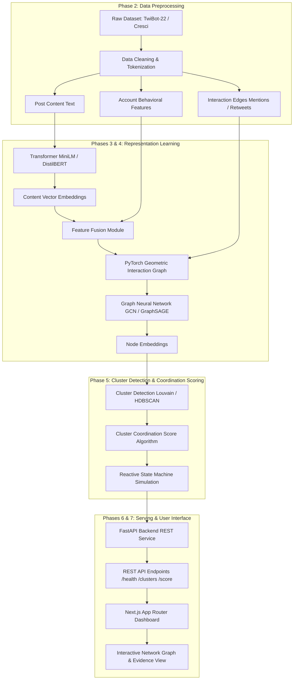

# System Architecture Specification — SyncNet

**Status**: `[PLANNED SPECIFICATION]` — Phase 1 Baseline Architecture  
**Project**: SyncNet: Coordinated Bot-Network Detection with Reactive Throttling  

---

## 1. High-Level Architecture Overview

SyncNet integrates multimodal feature extraction, graph neural network topology learning, cluster coordination scoring, and reactive decision support within a FastAPI backend and Next.js frontend.

---

## 2. Component Specifications

### 2.1 Feature Fusion Pipeline
- **Input**: 
  - Text Content: Posts tokenized and processed by a frozen/fine-tuned MiniLM or DistilBERT model into text embedding vectors $E_{text} \in \mathbb{R}^{d_{text}}$.
  - Behavioral Attributes: Normalized numerical features (account age, post frequency, follower-following ratio, retweet ratio) $B \in \mathbb{R}^{d_{beh}}$.
- **Fusion**: Concatenation and linear projection:
  $$X_{node} = \text{LayerNorm}(\mathbf{W}_f [E_{text} \,||\, B] + \mathbf{b}_f)$$

### 2.2 PyTorch Geometric Graph Engine
- **Nodes**: Social network accounts ($V$).
- **Edges**: Interaction links ($E$) representing user-user mentions, retweets, and replies.
- **Architectures**:
  - **GCN Baseline**: Graph Convolutional Network using normalized adjacency.
  - **GraphSAGE**: Neighborhood sampling and inductive aggregation (`SAGEConv`).

### 2.3 Cluster Coordination Scoring
- Identifies densely connected subgraphs exhibiting synchronized activity.
- Computes cluster-level score $S_{cluster} \in [0, 1]$ based on node representations, interaction density, and timing synchrony.

### 2.4 Reactive State Machine (Simulated)
- **States**:
  - `NORMAL`: Standard account behavior.
  - `FLAGGED`: Coordination score exceeds warning threshold $\tau_{flag}$.
  - `THROTTLED`: High-confidence coordination detected; rate-limiting simulated.
  - `ESCALATED`: Critical network-wide anomaly; human review required.
  - `DECAYING`: Automatic score reduction over time interval without new suspicious activity.
  - `APPEALED`: Manual override or successful simulation appeal.

---

## 3. Data Flow Specification

| Pipeline Stage | Input Data Structure | Output Data Structure | File / Module | Purpose |
| :--- | :--- | :--- | :--- | :--- |
| **Data Ingestion** | Raw JSON / CSV posts | Clean DataFrame | `scripts/preprocess_data.py` | Data normalization |
| **Text Embedding** | Raw post text strings | Tensor `[N, d_text]` | `notebooks/03_transformer_embeddings.ipynb` | Semantic representation |
| **Graph Build** | Edge tuples `(u, v, weight)` | PyG `Data(x, edge_index)` | `notebooks/05_graph_construction.ipynb` | Topology encoding |
| **GNN Forward** | PyG `Data` object | Tensor `[N, d_hidden]` | `notebooks/07_graphsage_experiment.ipynb` | Structural representation |
| **Clustering** | Node embeddings `[N, d_hidden]` | Cluster IDs `[N]` | `notebooks/09_cluster_detection.ipynb` | Network partitioning |
| **Serving API** | REST HTTP Request | JSON response payload | `backend/app/main.py` | Decision support delivery |
